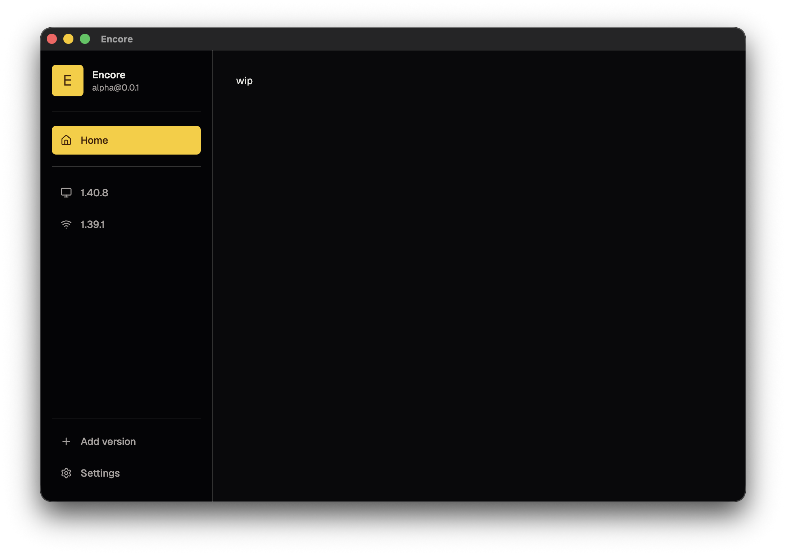

_We're in super early development. None of what you expect has been implemented in the slightest. Downloading and attempting to use a release right now is the equivalent of installing a brick, except a brick has more use cases_

# Encore

Encore is a Beat Saber player companion desktop app for Windows, Linux and remote Beat Saber installs from macOS

Mostly going to be spearheaded by the creator of the original [Beat Saber Mod Manager](https://github.com/Umbranoxio/BeatSaberModInstaller). More info about contributors can be found in the yapping below under [Active maintainers](#active-maintainers)

_(logo pending if you're an artist hit us up either at contact@scoresaber.com or our lead devs socials listed [here](https://umbranox.dev/), **no sloppers**.)_

## What's Encore and why

This project spawned because we wanted an all in one launcher for Beat Saber with a modern tech stack, good performance, clean UX and new cool features we believe are missing in other solutions

We really want this to feel clean with no fancy animations getting in your way. Just snappy and to the point, the focus should be getting into Beat Saber not "enjoying" Encore (all though we hope you do!)

### Home

A rich home experience which acts as a hub to all the communities around Beat Saber with quick and easy quick links to known places to get support (like the BSMG discord) and in-client troubleshooting help (common problems, quick log browser for last game sessions, copy log file to clipboard, log file uploader which quickly uploads your logs to send to support)...

### **Unofficial Mod Repositories**

Instead of just sourcing mods from Beatmods, adding Unofficial Mod Repositories would be very neat for users who want mods from the very bleeding edge at their own risk: see [VRChat Creator Companion](https://github.com/vrchat-community/creator-companion) for a first class example of this

To do this nicely we'll have a dynamic denylist that's easy for users to report to incase a popular unofficial repository is compromised or is known to be shady in general. Open, clear to see by anyone moderation of this is a vital priority.

### Quest standalone modding support

Should feel exactly like the PC experience with obvious limitations with connectors for already known popular quest mod repositories

### Feature parity with [BSManager](https://github.com/Zagrios/bs-manager).. but done in our own way

A seamless one-click migrator for BSManager -> Encore will exist on first launch or in the settings menu

### ScoreSaber integration

Unsure what this will look like yet, this very may well turn into "the ScoreSaber PC client"

### Active maintainers

We have the ScoreSaber development team and we will be actively looking to onboard more maintainers in general, and for this project as the roadmap is finalized

### Remote installs

This is very niche and probably only relevant for some, but as macOS is my daily driver being able to mod (and launch) my windows installs from the comfort of my Mac would be very nice. Also can be useful for tournament operators using Ludus on a remote streaming machine (like BSWC)

...will probably add more to this but you get the gist

No timelines or announcements just yet so if you're reading this, hey! You're the first to the party!
We'll be working on this on the side during our free time when not working on ScoreSaber.

## What it currently looks like

Riveting stuff. Colour theming support will be a thing.

## Why not Tauri?

Yeah, we'd love a smaller file size & memory footprint too. Unfortunately through our own testing from a performance POV Tauri did not hold up, webkit blows chunks & the experience on Linux is even worse. While we hope this changes in the future and will migrate to it if it does, our biggest concern is performance and Tauri just really isn't hitting the mark there.

## Getting Started

See [SETUP.md](SETUP.md) for the local development guide

## Contributing

See [CONTRIBUTING.md](CONTRIBUTING.md) for code standards and pull request expectations
